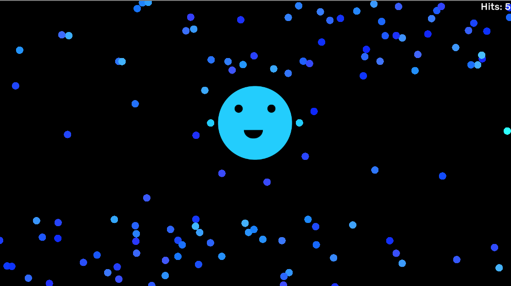

# Rhythm-Bullet-Hell

This was the project that I made during HackBCA V, a hackathon for high school students. In this 24-hour nonstop hackathon, students work on a project with optional workshops and activites on the side. This is what I made for the hackathon. **This is by no means representative of the neatness and efficiency of code that I usually write.** Due to the constraints of the environment (start working on the project at 6:30 pm, submit by 11:00 am), I threw efficiency and neatness of code to the bottom of my priorities. I just wanted to get what I wanted to get done, even if it were to write messy code.

As for the projct itself, I was heavily inspired by the game Just Shapes and Beats and wanted to make something similar, combining rhythm and bullet hell game elements. This was my result that I made in Unity. A build for MacOSX is provided.
